::: {.hero}
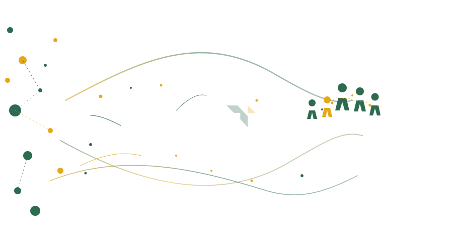{.hero-illustration .slow-pulse}

::: {.brand-tag}
Taara
:::

::: {.subtitle}
We help advocacy organizations turn data chaos into campaign-ready infrastructure — so you can focus on what matters: organizing, mobilizing, and winning.
:::

::: {.cta-group}
[Our Services](#our-services){.btn-primary-hero}
[Get in Touch](contactus.qmd){.btn-outline-hero}
:::
:::

---

## Our Services {#our-services}

::: {.services-grid}

::: {.service-card}
::: {.icon}
🧭
:::
### Strategy & Planning
We help you figure out where to go and how to get there.

- Data & tech consulting
- AI policy buildout & implementation
- Vendor evaluation & selection
- Change management support
:::

::: {.service-card}
::: {.icon}
⚙️
:::
### Tools & Systems
We set up and configure the platforms your team runs on.

- CRM/software implementation & configuration
- Workflow automation
- Reporting & dashboard development
- Data integration & ETL development
:::

::: {.service-card}
::: {.icon}
🗄️
:::
### Data Infrastructure
We make sure your data is clean, reliable, and ready.

- Data architecture & modeling
- Data quality assessment & remediation
- Data cleanup & formatting
:::

::: {.service-card}
::: {.icon}
📚
:::
### Training & Enablement
We build your team's confidence and capability with data.

- Data & tech trainings & workshops
- Project management
- Hands-on coaching
:::

:::

---

## Trusted By {#our-partners}

::: {.partners-carousel}
::: {.partners-track}
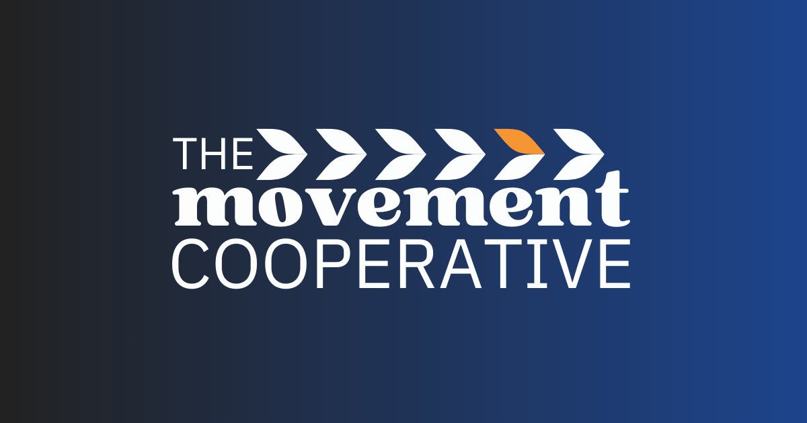
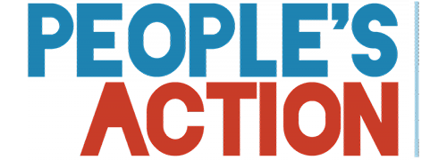
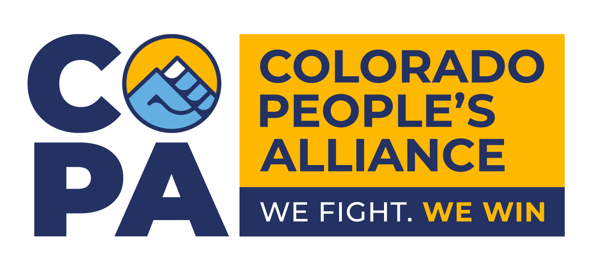
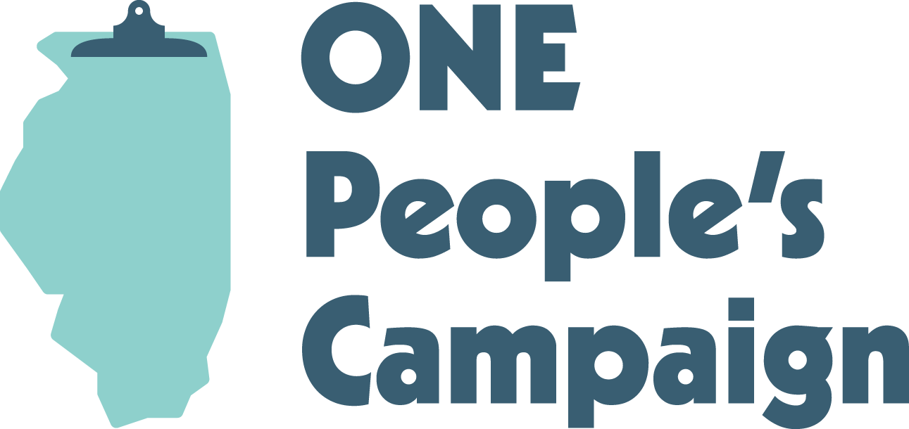

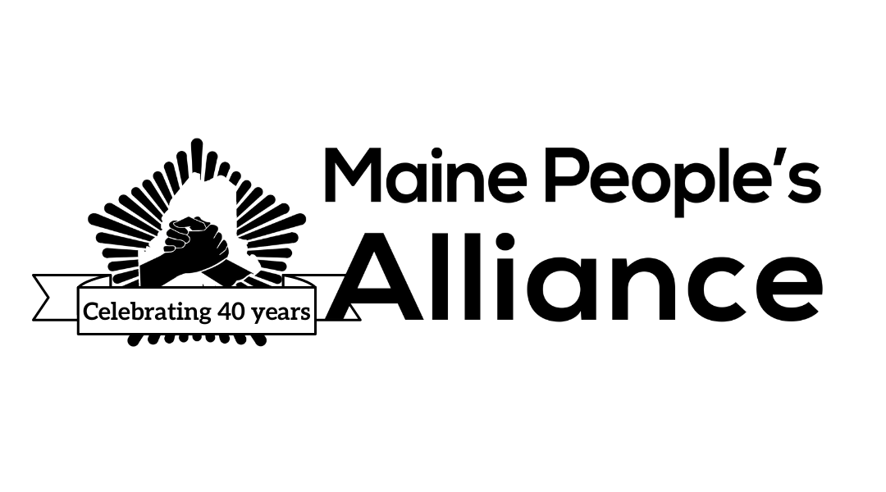
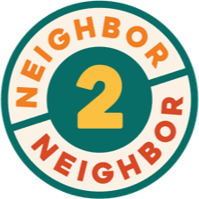
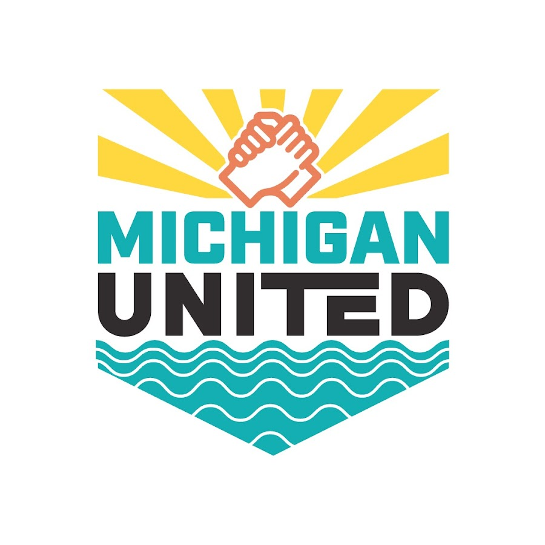
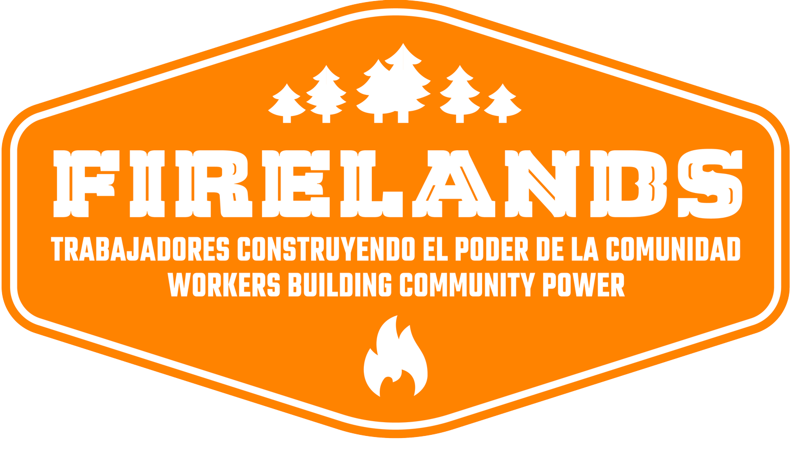
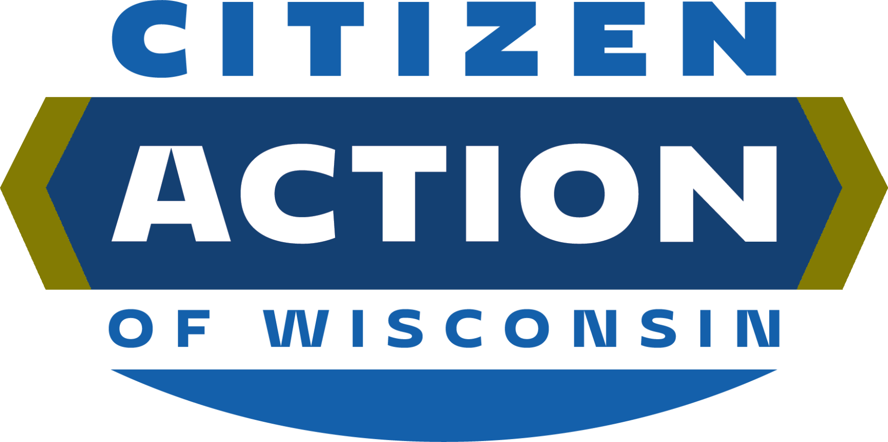
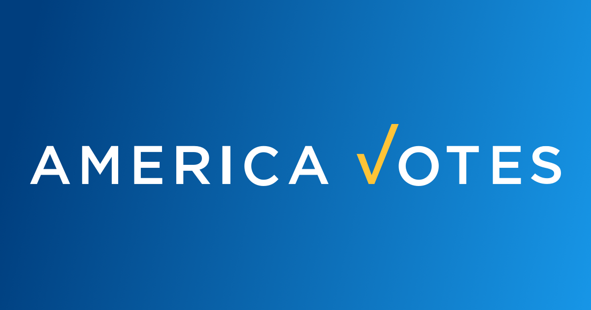
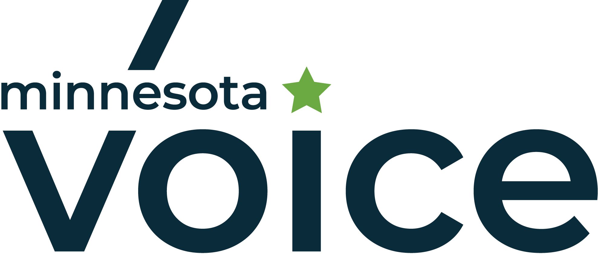

<!-- Duplicate for seamless loop -->

:::
:::

---

::: {.cta-section}
## Ready to get your data working for you?

We work on fixed-scope project engagements with clear deliverables and timelines. Let's talk about what your organization needs.

[Get in Touch](contactus.qmd){.btn-primary-hero}
:::
